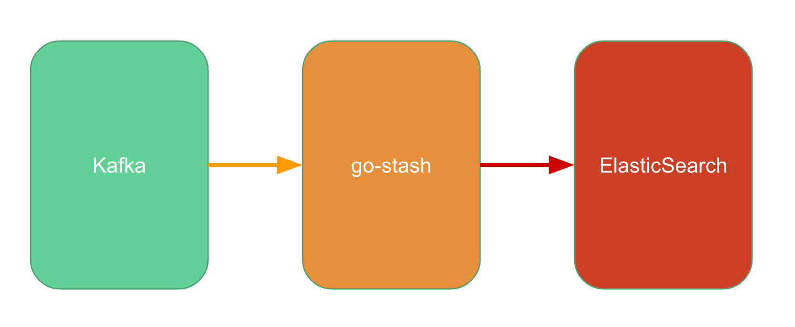

# go-stash简介

go-stash是一个高效的从Kafka获取，根据配置的规则进行处理，然后发送到ElasticSearch集群的工具。

go-stash有大概logstash 5倍的吞吐性能，并且部署简单，一个可执行文件即可。



## Quick Start

```shell
gostash -f etc/config.yaml
```

config.yaml示例如下:

```yaml
Input:
  Kafka:
    Name: gostash
    Brokers:
      - 172.16.186.16:19092
      - 172.16.186.17:19092
    Topic: k8slog
    Group: pro
    NumProducers: 16
Filters:
  - Action: drop
    Conditions:
      - Key: k8s_container_name
        Value: "-rpc"
        Type: contains
      - Key: level
        Value: info
        Type: match
        Op: and
  - Action: remove_field
    Fields:
      - message
      - _source
      - _type
      - _score
      - _id
      - "@version"
      - topic
      - index
      - beat
      - docker_container
      - offset
      - prospector
      - source
      - stream
Output:
  ElasticSearch:
    Hosts:
      - 172.16.141.4:9200
      - 172.16.141.5:9200
    DailyIndexPrefix: k8s_pro-
```